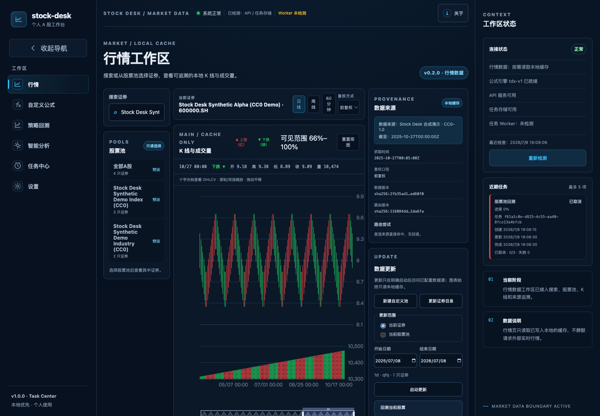
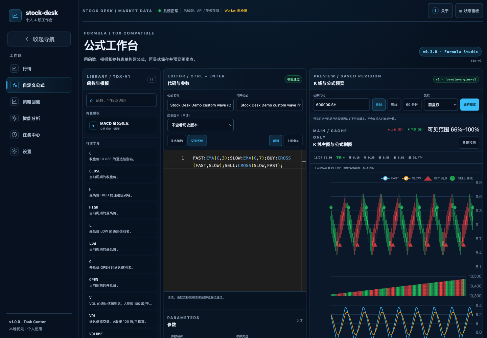
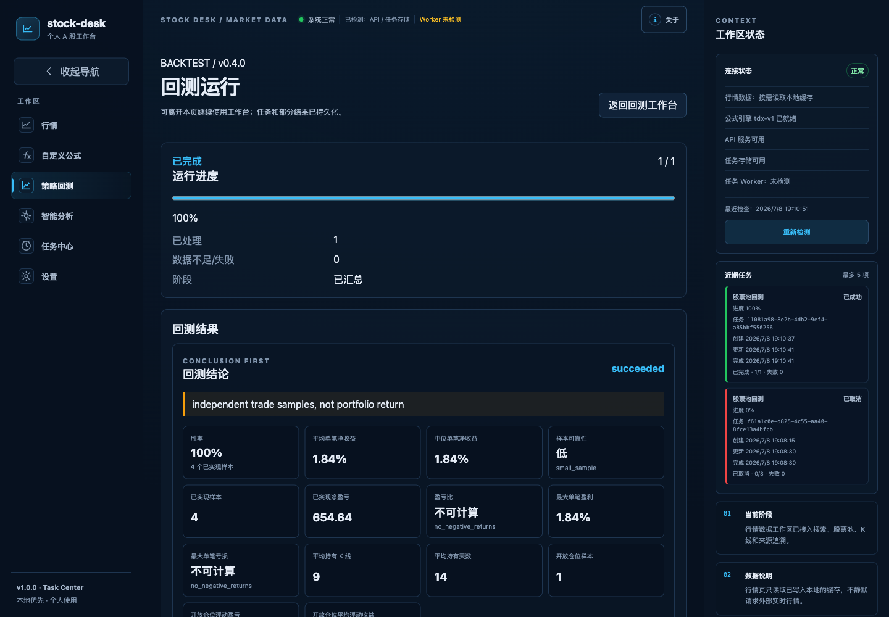
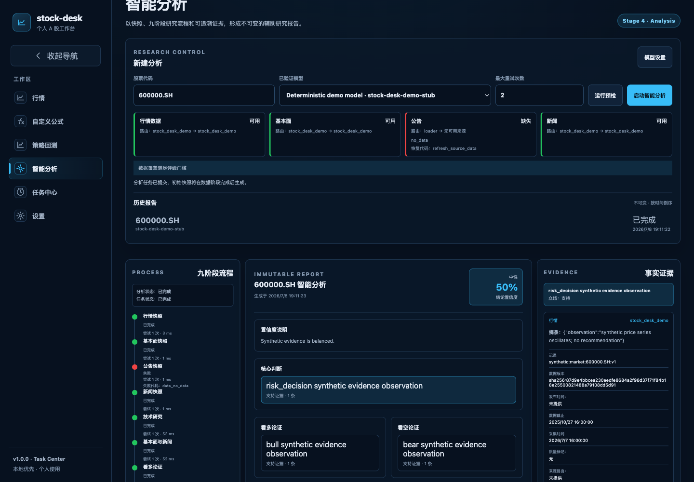

[简体中文](README.zh-CN.md)

# Stock Desk

Stock Desk v1.0.0 is a local-first personal A-share research desk for traceable
market charts, TDX-compatible formulas, reproducible historical backtests, and
evidence-linked multi-agent research. It does not connect to a broker or place
orders.



## Core workflows

- Inspect cache-only daily, weekly, and 60-minute charts with source, cutoff,
  adjustment, dataset, and route evidence.
- Build and version indicators or trading formulas in a visual,
  TDX-compatible editor; preview the K-line main chart, formula subchart, and
  BUY/SELL signals.
- Backtest saved formula versions with explicit A-share T+1, cost, lot, data
  coverage, replay, export, and immutable-result semantics.
- Run DeepSeek-oriented, OpenAI-compatible, or local Ollama research workflows;
  conclusions remain linked to persisted evidence.

| Formula preview | Backtest conclusion | Evidence-linked research |
| --- | --- | --- |
|  |  |  |

## Quick start

Windows and macOS users should choose the source-free artifact attached to a
release:

- `stock-desk-<version>-windows-x86_64.exe`
- `stock-desk-<version>-macos-x86_64.dmg`
- `stock-desk-<version>-macos-arm64.dmg`

Check its `.sha256` and target manifest, then verify both provenance and the
SPDX SBOM attestation with an authenticated GitHub CLI:

```bash
gh attestation verify INSTALLER_PATH --repo CongBao/stock-desk --signer-workflow CongBao/stock-desk/.github/workflows/release.yml
gh attestation verify INSTALLER_PATH --repo CongBao/stock-desk --signer-workflow CongBao/stock-desk/.github/workflows/release.yml --predicate-type https://spdx.dev/Document/v2.3
```

Run the installer, or copy the matching macOS app from the DMG to Applications.
It starts its bundled services on loopback and opens Stock Desk automatically.

For Linux or a private loopback-only container deployment:

```bash
docker compose up --build --wait
# open http://localhost:8000/market
docker compose down --volumes --remove-orphans
```

Source contributors use [CONTRIBUTING.md](CONTRIBUTING.md), then open
[http://localhost:5173/market](http://localhost:5173/market). Keep both modes
private: Stock Desk has no authentication, authorization, or TLS.

## Documentation

The bilingual [GitHub Wiki](https://github.com/CongBao/stock-desk/wiki) contains
installation, chart, formula, backtest, analysis, task, configuration, backup,
and recovery walkthroughs with release-candidate screenshots.

Repository references: [architecture](docs/architecture.md),
[configuration](docs/configuration.md), [troubleshooting](docs/troubleshooting.md),
[backup and restore](docs/backup-and-restore.md), [changelog](CHANGELOG.md), and
[roadmap](ROADMAP.md).

Verify the public-documentation contract locally:

```bash
uv run --frozen python scripts/verify_docs.py
```

## Safety and scope

Stock Desk is research software, not investment advice. Data may be delayed,
incomplete, adjusted, or restricted; formulas, backtests, and model output can
be wrong. Independently verify every decision and read the full
[disclaimer](docs/disclaimer.md).

Never publish credentials, `.env`, `STOCK_DESK_MASTER_KEY`, TDX paths, databases,
backups, or licensed market data. Report vulnerabilities through
[SECURITY.md](SECURITY.md).

## Contributing

See [CONTRIBUTING.md](CONTRIBUTING.md), [support](SUPPORT.md), and the
[Code of Conduct](CODE_OF_CONDUCT.md). Licensed under
[Apache-2.0](LICENSE).
